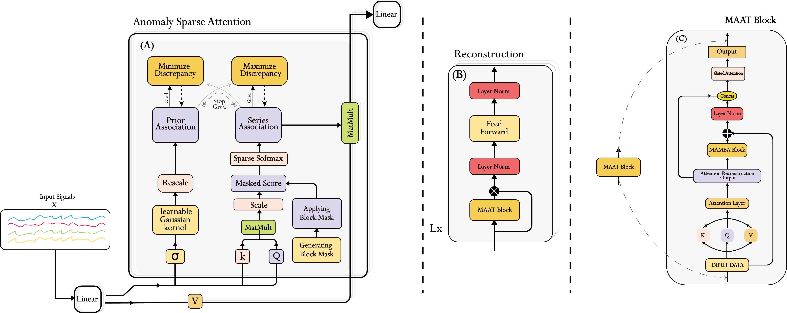
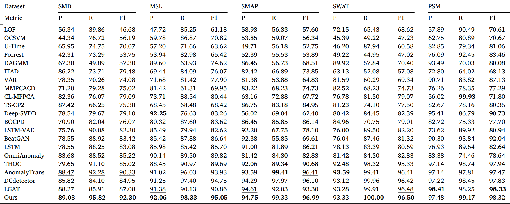

# MAAT: Mamba Adaptive Anomaly Transformer
Authors: Abdellah Zakaria Sellam*, Ilyes Benaissa, Abdelmalik Taleb-Ahmed, Luigi
Patrono, Cosimo Distante
[](https://paperswithcode.com/sota/anomaly-detection-on-smd?p=maat-mamba-adaptive-anomaly-transformer-with)
## Paper
Paper Accepted and Published 🤩.

You can check our paper now in Engineering Applications of Artificial Intelligence journal:
check it in this link: https://doi.org/10.1016/j.engappai.2025.111685
## Abstract
Anomaly detection in time series poses a critical challenge in industrial moni-
toring, environmental sensing, and infrastructure reliability, where accurately
distinguishing anomalies from complex temporal patterns remains an open
problem. While existing methods, such as the Anomaly Transformer lever-
aging multi-layer association discrepancy between prior and series distribu-
tions and DCdetector employing dual-attention contrastive learning, have
advanced the field, critical limitations persist. These include sensitivity
to short-term context windows, computational inefficiency, and degraded
performance under noisy and non-stationary real-world conditions. To ad-
dress these challenges, we present MAAT (Mamba Adaptive Anomaly Trans-
former), an enhanced architecture that refines association discrepancy model-
ing and reconstruction quality for more robust anomaly detection. Our work
introduces two key contributions to the existing Anomaly transformer ar-
chitecture: Sparse Attention, which computes association discrepancy more
efficiently by selectively focusing on the most relevant time steps. This re-
duces computational redundancy while effectively capturing long-range de-
pendencies critical for discerning subtle anomalies. A Mamba-Selective State
Space Model (Mamba-SSM) is also integrated into the reconstruction mod-
ule. A skip connection bridges the original reconstruction and the Mamba-
SSM output, while a Gated Attention mechanism adaptively fuses features
from both pathways. This design balances fidelity and contextual enhancement dynamically, 
improving anomaly localization and overall detection performance. 
Extensive experiments on benchmark datasets demonstrate that
MAAT significantly outperforms prior methods, achieving superior anomaly
distinguishability and generalization across diverse time series applications.
By addressing the limitations of existing approaches, MAAT sets a new stan-
dard for unsupervised time series anomaly detection in real-world scenarios.

Keywords:  MAAT, Transformer, Association Discrepancy, Gated Attention, Mamba-SSM, Sparse Attention, Anomaly Detection, Unsupervised Learning

## Architecture


## Results


## Get Start
1. Create new virtual environement with Python 3.10 .
2. Clone the repo.
3. Install the requirements using: ```pip install -r requirements.txt```.
4. Download data.
5. Train and evaluate. using the scripts in ./scripts folder:
```bash
bash ./scripts/SMD.sh
bash ./scripts/MSL.sh
bash ./scripts/SMAP.sh
bash ./scripts/PSM.sh
bash ./scripts/SWAT.sh
bash ./scripts/NIPS_TS_Swan.sh
bash ./scripts/NIPS_TS_Water.sh
```
## Citation
If you find this repo useful, please cite our paper.

```
@article{SELLAM2025111685,
title = {Mamba Adaptive Anomaly Transformer with association discrepancy for time series},
journal = {Engineering Applications of Artificial Intelligence},
volume = {160},
pages = {111685},
year = {2025},
issn = {0952-1976},
doi = {https://doi.org/10.1016/j.engappai.2025.111685},
url = {https://www.sciencedirect.com/science/article/pii/S0952197625016872},
author = {Abdellah Zakaria Sellam and Ilyes Benaissa and Abdelmalik Taleb-Ahmed and Luigi Patrono and Cosimo Distante},
keywords = {Transformer, Association discrepancy, Gated attention, Mamba state space model, Sparse attention, Anomaly detection, Unsupervised learning},
}
```
## Contact
If you have any question or want to use the code, please contact z.abdellah.sellam@gmail.com, ilyesbenaissa7429@gmail.com, abdelmalik.taleb-ahmed@uphf.fr, cosimo.distante@cnr.it.
